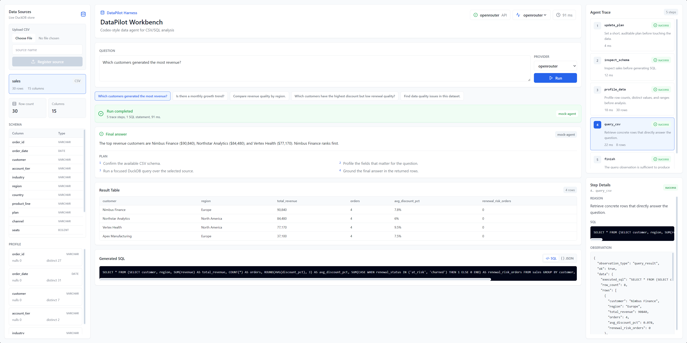
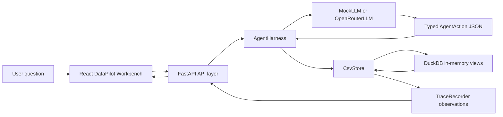

# datapilot-harness

`datapilot-harness` is a compact Codex-style data agent for CSV and SQL analysis. It plans the analysis, chooses typed actions, executes safe DuckDB queries, records observations, and returns grounded final answers through both a CLI and a polished web workbench.

The project has two modes:

- CLI mode for inspecting the core agent harness from a terminal.
- Web UI mode for DataPilot Workbench, a React interface with sources, generated SQL, result tables, and an observable agent trace.

## Product Positioning

DataPilot Harness is a portfolio-ready demo of practical agent engineering: typed actions, safe SQL execution, traceable reasoning steps, and a frontend that makes each run inspectable.

The stack is intentionally small and explicit. It avoids LangChain, LlamaIndex, LangGraph, embeddings, vector databases, auth, and multi-user persistence so the core harness, validation, and trace flow stay easy to review.

## Quick Start

Install Python dependencies:

```bash
uv sync
```

Run the FastAPI backend:

```bash
uv run uvicorn datapilot.api.main:app --reload
```

Run the React frontend:

```bash
cd frontend
npm install
npm run dev
```

Open the Vite URL, usually `http://localhost:5173`.

Mock mode is the default and does not require an API key. OpenRouter mode is still available through the backend when `OPENROUTER_API_KEY` and `OPENROUTER_MODEL` are set in the environment.

## Demo Script

Use this flow to understand the project quickly:

1. Start the backend:

   ```bash
   uv run uvicorn datapilot.api.main:app --reload
   ```

2. Start the frontend:

   ```bash
   cd frontend
   npm install
   npm run dev
   ```

3. Open the workbench at `http://localhost:5173`.
4. Use the bundled `sales` source loaded by the API.
5. Click `Which customers generated the most revenue?`.
6. Press `Run`.
7. Inspect the generated SQL in the center panel.
8. Inspect the agent trace on the right to see `update_plan`, `inspect_schema`, `profile_data`, `query_csv`, and `finish`.

## CLI Mode

Create a `.env` file when using OpenRouter through the CLI:

```env
OPENROUTER_API_KEY=sk-or-xxx
OPENROUTER_MODEL=deepseek/deepseek-v4-flash
```

Run a one-shot question:

```bash
uv run python -m datapilot "Which customers generated the most revenue, and is there a monthly growth trend?" --csv sales=examples/sales.csv
```

Run an interactive session:

```bash
uv run python -m datapilot "Which customers generated the most revenue?" --csv sales=examples/sales.csv --interactive
```

Then ask follow-ups in the same session:

```text
Follow-up: Break that down by product line.
Follow-up: Which at-risk accounts should I inspect first?
Follow-up: What query did you use for the trend?
```

You can register multiple CSV sources:

```bash
uv run python -m datapilot "Compare revenue quality across the available sources" --csv sales=examples/sales.csv --csv users=examples/users.csv
```

The source name on the left side of `=` becomes the DuckDB view name and must match:

```text
^[A-Za-z_][A-Za-z0-9_]*$
```

## Web UI Mode

The FastAPI app exposes:

- `GET /api/health`
- `GET /api/config`
- `POST /api/sources/upload`
- `GET /api/sources`
- `POST /api/runs`
- `GET /api/runs/{run_id}`

The frontend is a React + TypeScript + Vite + Tailwind workbench with three columns:

- Data Sources: upload CSV, source stats, schema, and profile summary.
- Analysis Run: question input, sample prompts, final answer, results, SQL, and raw JSON.
- Agent Trace: timeline of typed actions and step details.

If the API is unavailable, the frontend loads `frontend/src/demo/staticRun.ts` so a static deployment, such as GitHub Pages, still shows the workbench.

## Screenshots

Desktop workbench:



## Architecture



Supported actions:

- `update_plan`
- `inspect_schema`
- `profile_data`
- `query_csv`
- `repair_query`
- `finish`

## Demo Dataset

The included `examples/sales.csv` is a synthetic B2B SaaS revenue dataset with customer, industry, region, product line, plan, channel, seats, discount, revenue, contract length, and renewal status.

The API preloads this file as `sales` when it is available, so the workbench has a useful mock-mode dataset immediately after startup.

## Safety

- SELECT only
- allowed tables only
- enforced result limit of 50 rows
- no mutation statements
- SQL parsed with `sqlglot` using the DuckDB dialect
- CSV paths passed through the DuckDB Python API, not interpolated into SQL
- tool errors captured as observations and shown in the trace
- API keys stay on the backend and are never exposed to the frontend

## Tests And Lint

```bash
uv run pytest
uv run ruff check .
cd frontend
npm run build
```

## Roadmap

- SQL connector
- ToolRegistry
- MCP adapter
- export to CSV/Markdown
- Docker packaging
